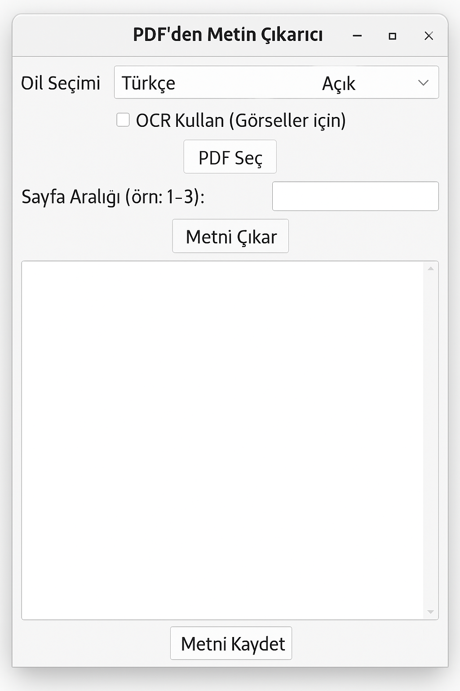

# 📄 PDF Metin Çıkarıcı (PDF Text Extractor)

Bu Python uygulaması, PDF dosyalarından metin çıkarmak için grafik arayüz (GUI) sunar. Hem metin tabanlı PDF'lerden hem de taranmış (görsel içerikli) PDF'lerden metin alma özelliğine sahiptir. Açık/Koyu tema desteği ve çoklu dil seçenekleriyle kullanımı oldukça kolaydır.

---

## 🚀 Özellikler

- ✅ **PDF Seçimi** – Dosya seçme penceresiyle kolay PDF yükleme  
- 🔢 **Sayfa Aralığı Belirleme** – Tüm belge yerine belirli sayfaları analiz etme  
- 🧠 **OCR Desteği (Tesseract)** – Görsel içerikli PDF’lerden metin çıkarma  
- 💾 **Metni Kaydetme** – `.txt` formatında çıktı alma  
- 🌍 **Dil Seçimi** – Türkçe 🇹🇷 ve İngilizce 🇬🇧 desteği  
- 💡 **Tema Desteği** – Açık ve Koyu mod  

---

## 🖼️ Arayüz

<p align="center">
  

---

## 🛠️ Gereksinimler

Aşağıdaki Python paketleri ve araçlar kurulmalıdır:

```bash
pip install PyMuPDF pytesseract Pillow
